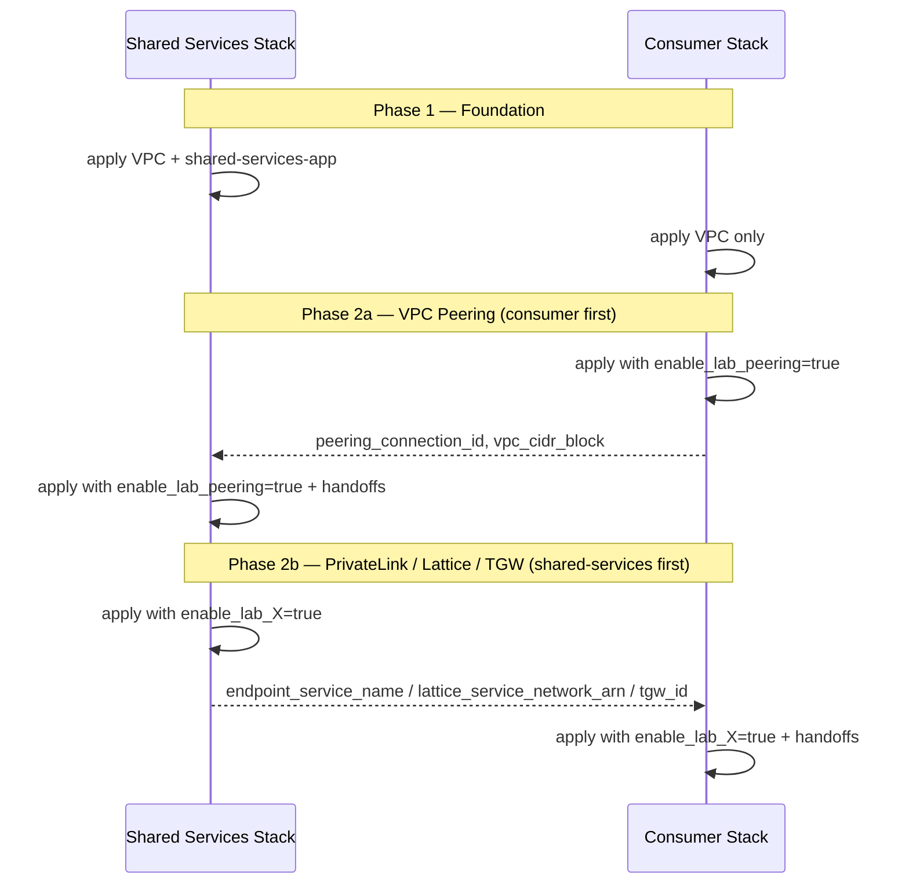

# Design Document: AWS Private Connectivity Patterns Demo

## Overview

This project is a hands-on Terraform demo comparing four AWS private service connectivity patterns for cross-VPC, cross-account east-west traffic. A shared-services account hosts a simple HTTP API behind an internal ALB. Consumer accounts (dev, sandbox) reach that API using four isolated labs — VPC Peering, PrivateLink, VPC Lattice, and Transit Gateway — each enabled independently via boolean feature flags with mutual exclusion enforcement on **both** shared-services and consumer stacks.

The demo targets presenters who deploy infrastructure with Terraform, test connectivity with curl from consumer Test EC2 instances via SSM Session Manager, and tear down manually. All infrastructure runs in ap-southeast-2 in a single region, uses HTTP only (port 80), and relies on SSM endpoints instead of NAT/IGW for private subnet access.

**Implementation status:** This design is specification-ready. The repository currently contains only the README, LICENSE, and Kiro spec files — Terraform modules and account roots described below are not yet implemented.

### Key Design Decisions

| Decision | Choice | Rationale |
|----------|--------|-----------|
| Shared Services CIDR | 10.10.0.0/16 | Large enough for demo, non-overlapping with consumers |
| Dev CIDR | 10.20.0.0/16 | Non-overlapping with shared-services and sandbox |
| Sandbox CIDR | 10.30.0.0/16 | Non-overlapping with shared-services and dev |
| Region | ap-southeast-2 | Single-region simplicity |
| Protocol | HTTP only (port 80) | Demo simplicity, no TLS complexity |
| Compute | EC2 (t4g.nano test, shared-services-app EC2) | Simple, cheap, ARM-based |
| Private access | SSM endpoints (no NAT/IGW) | True private subnet pattern |
| Cross-account auth | AWS_PROFILE (no assume_role) | Presenter controls profiles locally; each stack is a separate apply |
| Lab isolation | Feature flags with mutual exclusion | One lab per stack at a time |
| Lab modules | `deployment_side` variable | Same module source, shared-services vs consumer resource subsets |
| PrivateLink pattern | NLB in front of ALB | Required by VPC Endpoint Service |
| Resource sharing | RAM for Lattice and TGW | Standard cross-account sharing |
| Peering/PrivateLink acceptance | Auto-accept enabled | Demo speed, no manual approval |
| Pattern identification | `connectivity_pattern` variable | Provider JSON response reflects active lab without request sniffing |

## Architecture

### Network Topology

```mermaid
graph TB
    subgraph Shared Services Account
        subgraph Shared Services VPC [Shared Services VPC - 10.10.0.0/16]
            ALB[Internal ALB :80]
            EC2P[Provider App EC2]
            NLB[NLB :80 - PrivateLink only]
            SSMP[SSM Endpoints]
            TEC2P[Test EC2 - optional]
        end
        VPCES[VPC Endpoint Service]
        LATTICE_SVC[Lattice Service]
        LATTICE_NET[Service Network]
        TGW[Transit Gateway]
    end

    subgraph Dev Account [Dev Account - Consumer]
        subgraph Dev VPC [Dev VPC - 10.20.0.0/16]
            TEC2D[Test EC2 t4g.nano]
            SSMD[SSM Endpoints]
            VPCE_D[Interface VPC Endpoint]
        end
    end

    subgraph Sandbox Account [Sandbox Account - Consumer]
        subgraph Sandbox VPC [Sandbox VPC - 10.30.0.0/16]
            TEC2S[Test EC2 t4g.nano]
            SSMS[SSM Endpoints]
            VPCE_S[Interface VPC Endpoint]
        end
    end

    %% Connectivity Patterns
    Dev VPC ---|VPC Peering| Shared Services VPC
    VPCE_D ---|PrivateLink| VPCES
    Dev VPC ---|Lattice Association| LATTICE_NET
    Dev VPC ---|TGW Attachment| TGW
    TGW ---|TGW Attachment| Shared Services VPC

    %% Shared services internal
    ALB --> EC2P
    NLB --> ALB
    VPCES --> NLB
    LATTICE_SVC --> ALB
    LATTICE_NET --> LATTICE_SVC

    %% RAM Sharing
    LATTICE_NET -.->|RAM Share| Dev VPC
    TGW -.->|RAM Share| Dev VPC
```

### Account Structure

| Account | Role | VPC CIDR | AWS_PROFILE |
|---------|------|----------|-------------|
| Shared services | Hosts internal ALB API, NLB, Lattice service, TGW | 10.10.0.0/16 | shared-services |
| Dev | Consumer — tests connectivity patterns | 10.20.0.0/16 | dev |
| Sandbox | Consumer — tests connectivity patterns | 10.30.0.0/16 | sandbox |

### Connectivity Patterns Summary

| Pattern | OSI Layer | Shared-services-side Resources | Consumer-Side Resources | DNS for curl test |
|---------|-----------|------------------------|------------------------|-------------------|
| VPC Peering | L3 | Accept peering, routes, SG rules | Request peering, routes, SG rules | `alb_dns_name` |
| PrivateLink | L4 | NLB → ALB, Endpoint Service | Interface VPC Endpoint | `endpoint_dns_name` |
| VPC Lattice | L7 | Lattice Service, Service Network, RAM | VPC association with Service Network | `lattice_service_dns_name` |
| Transit Gateway | L3 | TGW, attachment, routes, RAM | TGW attachment, routes | `alb_dns_name` |

### Cross-Stack Deployment Model

Because the demo deliberately avoids `assume_role`, each account root is applied independently with a different `AWS_PROFILE`. Values pass between stacks via `terraform output` → `terraform.tfvars` or `-var` flags.



### Cross-Stack Variable Handoffs

| Lab | Shared services outputs → Consumer inputs | Consumer outputs → Provider inputs | Apply order |
|-----|-----------------------------------|-----------------------------------|-------------|
| VPC Peering | `shared_services_vpc_id`, `shared_services_account_id` (always); `alb_dns_name` (testing) | `peering_connection_id`, `vpc_cidr_block` | Consumer, then shared-services |
| PrivateLink | `endpoint_service_name` | — | Provider, then consumer |
| VPC Lattice | `lattice_service_network_arn`, `lattice_service_dns_name` | — | Provider, then consumer |
| Transit Gateway | `tgw_id` | `vpc_cidr_block` | Provider, then consumer |

### Deployment Strategy

All account roots use the default AWS credential chain via `AWS_PROFILE`. No `assume_role` blocks are used.

```hcl
# terraform/accounts/shared-services/main.tf
provider "aws" {
  region = var.aws_region

  default_tags {
    tags = {
      Project   = "aws-private-connectivity-patterns-demo"
      Account   = "shared-services"
      ManagedBy = "terraform"
    }
  }
}
```

```hcl
# terraform/accounts/dev/main.tf
provider "aws" {
  region = var.aws_region

  default_tags {
    tags = {
      Project   = "aws-private-connectivity-patterns-demo"
      Account   = "dev"
      ManagedBy = "terraform"
    }
  }
}
```

Each account root uses the same `versions.tf` pattern:

```hcl
terraform {
  required_version = ">= 1.5"
  required_providers {
    aws = {
      source  = "hashicorp/aws"
      version = "~> 5.0"
    }
  }
}
```

Presenters configure profiles in `~/.aws/config`:

```ini
[profile shared-services]
region = ap-southeast-2
# ... credentials

[profile dev]
region = ap-southeast-2
# ... credentials

[profile sandbox]
region = ap-southeast-2
# ... credentials
```

Usage: `AWS_PROFILE=shared-services terraform -chdir=terraform/accounts/shared-services apply`

## Account Root Wiring

### Shared Services Account Root

The shared-services root composes foundation modules plus conditional lab modules. Lab modules are called with `deployment_side = "shared-services"`.

```hcl
module "vpc" {
  source       = "../../modules/vpc"
  cidr_block   = "10.10.0.0/16"
  project_name = var.project_name
  account_name = "shared-services"
}

module "shared_services_app" {
  source               = "../../modules/shared-services-app"
  vpc_id               = module.vpc.vpc_id
  subnet_ids           = module.vpc.private_subnet_ids
  vpc_cidr             = module.vpc.vpc_cidr_block
  connectivity_pattern = local.active_pattern # "shared-services" when no lab enabled
}

module "lab_peering_shared_services" {
  count  = var.enable_lab_peering ? 1 : 0
  source = "../../modules/lab-peering"

  deployment_side        = "shared-services"
  peering_connection_id  = var.peering_connection_id
  consumer_vpc_cidr      = var.consumer_vpc_cidr
  route_table_ids        = module.vpc.route_table_ids
  alb_security_group_id  = module.shared_services_app.security_group_id
}

# Similar count-gated calls for lab-privatelink, lab-lattice, lab-tgw
```

**Shared services outputs:**

| Output | When available | Used by |
|--------|---------------|---------|
| `vpc_id` | Always | Consumer stacks (peering) |
| `vpc_cidr_block` | Always | Documentation |
| `account_id` | Always | Consumer stacks (peering, PrivateLink principals) |
| `alb_dns_name` | Always | Peering/TGW curl tests |
| `endpoint_service_name` | `enable_lab_privatelink` | Consumer PrivateLink apply |
| `lattice_service_network_arn` | `enable_lab_lattice` | Consumer Lattice apply |
| `lattice_service_dns_name` | `enable_lab_lattice` | Lattice curl tests |
| `tgw_id` | `enable_lab_tgw` | Consumer TGW apply |

### Consumer Account Root

The consumer root composes foundation modules plus conditional lab modules with `deployment_side = "consumer"`.

```hcl
module "vpc" {
  source       = "../../modules/vpc"
  cidr_block   = var.vpc_cidr # 10.20.0.0/16 or 10.30.0.0/16
  project_name = var.project_name
  account_name = var.account_name # "dev" or "sandbox"
}

module "lab_peering_consumer" {
  count  = var.enable_lab_peering ? 1 : 0
  source = "../../modules/lab-peering"

  deployment_side     = "consumer"
  vpc_id              = module.vpc.vpc_id
  route_table_ids     = module.vpc.route_table_ids
  peer_vpc_id         = var.shared_services_vpc_id
  peer_account_id     = var.shared_services_account_id
  shared_services_vpc_cidr   = var.shared_services_vpc_cidr
  test_ec2_sg_id      = module.test_ec2[0].security_group_id
}
```

**Consumer outputs:**

| Output | When available | Used by |
|--------|---------------|---------|
| `vpc_id` | Always | Documentation |
| `vpc_cidr_block` | Always | Provider peering/TGW applies |
| `private_subnet_ids` | Always | Lab modules |
| `route_table_ids` | Always | Lab modules |
| `peering_connection_id` | `enable_lab_peering` | Provider peering apply |
| `endpoint_dns_name` | `enable_lab_privatelink` | PrivateLink curl tests |
| `test_ec2_instance_id` | `enable_test_ec2` | SSM session target |

## Components and Interfaces

### Module: vpc

**Purpose:** Creates a VPC with private subnets, DNS support, and SSM endpoints. No NAT or IGW.

**Location:** `terraform/modules/vpc/`

#### Inputs (variables.tf)

| Variable | Type | Required | Default | Description |
|----------|------|----------|---------|-------------|
| cidr_block | string | yes | — | VPC CIDR block (e.g., `10.10.0.0/16`) |
| project_name | string | yes | — | Project name for resource naming |
| account_name | string | yes | — | Account identifier (shared-services/dev/sandbox) |
| azs | list(string) | no | `["ap-southeast-2a", "ap-southeast-2b"]` | Availability zones for subnets |

#### Outputs (outputs.tf)

| Output | Type | Description |
|--------|------|-------------|
| vpc_id | string | ID of the created VPC |
| private_subnet_ids | list(string) | IDs of private subnets |
| route_table_ids | list(string) | IDs of private route tables |
| vpc_cidr_block | string | The VPC CIDR block |

#### Resources Created

- `aws_vpc` — VPC with DNS support and hostnames enabled
- `aws_subnet` (×2) — Private subnets across 2 AZs (`/24` per subnet)
- `aws_route_table` (×2) — One per subnet
- `aws_route_table_association` (×2) — Subnet-to-RT bindings
- `aws_security_group` — For SSM endpoints
- `aws_vpc_endpoint` (×3) — ssm, ssmmessages, ec2messages (Interface type)

### Module: shared-services-app

**Purpose:** Creates an Internal ALB with an EC2 backend serving a JSON API response.

**Location:** `terraform/modules/shared-services-app/`

#### Inputs (variables.tf)

| Variable | Type | Required | Default | Description |
|----------|------|----------|---------|-------------|
| vpc_id | string | yes | — | VPC ID for ALB and EC2 placement |
| subnet_ids | list(string) | yes | — | Subnet IDs for ALB (minimum 2 AZs) |
| vpc_cidr | string | yes | — | VPC CIDR for baseline security group rules |
| connectivity_pattern | string | no | `"shared-services"` | Value returned in JSON `pattern` field |

#### Outputs (outputs.tf)

| Output | Type | Description |
|--------|------|-------------|
| alb_dns_name | string | DNS name of the internal ALB |
| alb_arn | string | ARN of the ALB |
| alb_ip_addresses | list(string) | ALB ENI private IPs (for PrivateLink NLB targets) |
| target_group_arn | string | ARN of the ALB target group |
| security_group_id | string | Security group ID of the ALB |

#### Resources Created

- `data.aws_ami` — Amazon Linux 2023 ARM64 latest
- `aws_lb` — Internal ALB, HTTP listener on port 80
- `aws_lb_target_group` — HTTP target group
- `aws_lb_listener` — Port 80 HTTP listener with forward action
- `aws_instance` — EC2 running minimal HTTP server (`user_data`)
- `aws_lb_target_group_attachment` — Register EC2 to target group
- `aws_security_group` — ALB security group (ingress :80 from VPC CIDR; lab modules add cross-VPC rules)
- `aws_iam_role` + `aws_iam_instance_profile` — EC2 instance profile for SSM

#### Shared services App user_data behavior

The EC2 `user_data` script starts a minimal HTTP server on port 80. Every response returns:

```json
{
  "pattern": "<connectivity_pattern variable>",
  "hostname": "<ec2-hostname>",
  "instance_id": "<ec2-instance-id>",
  "timestamp": "<iso8601-timestamp>"
}
```

Account roots set `connectivity_pattern` to the active lab name when a lab flag is enabled.

### Module: test-ec2

**Purpose:** Creates a t4g.nano EC2 instance in a private subnet with SSM access for curl testing.

**Location:** `terraform/modules/test-ec2/`

#### Inputs (variables.tf)

| Variable | Type | Required | Default | Description |
|----------|------|----------|---------|-------------|
| vpc_id | string | yes | — | VPC ID for security group |
| subnet_id | string | yes | — | Subnet ID for EC2 placement |
| security_group_ids | list(string) | no | `[]` | Additional security group IDs to attach |

#### Outputs (outputs.tf)

| Output | Type | Description |
|--------|------|-------------|
| instance_id | string | EC2 instance ID (used for SSM session) |
| security_group_id | string | Test EC2 security group ID (for lab SG rules) |

#### Resources Created

- `data.aws_ami` — Amazon Linux 2023 ARM64 latest
- `aws_instance` — t4g.nano, no public IP
- `aws_iam_role` + `aws_iam_instance_profile` — SSM managed policy attached
- `aws_security_group` — Baseline egress for HTTP (lab modules add destination rules)

### Module: lab-peering

**Purpose:** Creates cross-account VPC peering with routes and security group rules. Resources are gated by `deployment_side`.

**Location:** `terraform/modules/lab-peering/`

#### Common Inputs

| Variable | Type | Required | Default | Description |
|----------|------|----------|---------|-------------|
| deployment_side | string | yes | — | `shared-services` or `consumer` |

#### Consumer-Side Inputs (`deployment_side = "consumer"`)

| Variable | Type | Required | Description |
|----------|------|----------|-------------|
| vpc_id | string | yes | Consumer VPC ID |
| route_table_ids | list(string) | yes | Consumer private route table IDs |
| peer_vpc_id | string | yes | Shared Services VPC ID |
| peer_account_id | string | yes | Provider AWS account ID |
| shared_services_vpc_cidr | string | yes | Shared Services VPC CIDR (`10.10.0.0/16`) |
| test_ec2_sg_id | string | no | Test EC2 SG for outbound HTTP rule |

#### Shared-services-side Inputs (`deployment_side = "shared-services"`)

| Variable | Type | Required | Description |
|----------|------|----------|-------------|
| peering_connection_id | string | yes | From consumer `terraform output` |
| consumer_vpc_cidr | string | yes | From consumer `terraform output` |
| route_table_ids | list(string) | yes | Provider private route table IDs |
| alb_security_group_id | string | yes | ALB SG for inbound HTTP rule |

#### Outputs

| Output | Side | Description |
|--------|------|-------------|
| peering_connection_id | consumer | ID of the VPC peering connection |

#### Resources by Side

**Consumer (`deployment_side = "consumer"`):**

- `aws_vpc_peering_connection` — Peering request to shared-services VPC
- `aws_route` (×N) — Routes to shared-services CIDR via peering connection
- `aws_security_group_rule` — Outbound HTTP to shared-services CIDR on Test EC2 SG

**Provider (`deployment_side = "shared-services"`):**

- `aws_vpc_peering_connection_accepter` — Auto-accept peering
- `aws_vpc_peering_connection_options` — Enable DNS resolution (requester + accepter)
- `aws_route` (×N) — Routes to consumer CIDR via peering connection
- `aws_security_group_rule` — Inbound HTTP from consumer CIDR on ALB SG

### Module: lab-privatelink

**Purpose:** Exposes the shared-services ALB through an NLB and VPC Endpoint Service; consumed via Interface VPC Endpoint.

**Location:** `terraform/modules/lab-privatelink/`

#### Shared-services-side Inputs (`deployment_side = "shared-services"`)

| Variable | Type | Required | Description |
|----------|------|----------|-------------|
| nlb_subnet_ids | list(string) | yes | Subnet IDs for NLB placement |
| alb_arn | string | yes | ARN of the internal ALB |
| alb_ip_addresses | list(string) | yes | ALB ENI private IPs for IP targets |
| vpc_id | string | yes | Shared Services VPC ID |
| allowed_principals | list(string) | yes | Consumer account IDs for auto-accept |

#### Consumer-Side Inputs (`deployment_side = "consumer"`)

| Variable | Type | Required | Description |
|----------|------|----------|-------------|
| endpoint_service_name | string | yes | VPC Endpoint Service name from shared-services |
| vpc_id | string | yes | Consumer VPC ID |
| subnet_ids | list(string) | yes | Subnet IDs for interface endpoint |
| test_ec2_sg_id | string | no | Test EC2 SG for outbound HTTP rule |

#### Outputs

| Output | Side | Description |
|--------|------|-------------|
| endpoint_service_name | shared-services | Service name for consumers |
| vpc_endpoint_id | consumer | Interface endpoint ID |
| endpoint_dns_name | consumer | Regional DNS name for curl tests |

#### Resources by Side

**Shared services:**

- `aws_lb` — NLB on TCP port 80
- `aws_lb_target_group` — IP-type target group pointing to ALB IPs
- `aws_lb_listener` — TCP:80 forward to target group
- `aws_vpc_endpoint_service` — Backed by NLB, auto-accept enabled
- `aws_vpc_endpoint_service_allowed_principal` — Consumer account ARN(s)

**Consumer:**

- `aws_vpc_endpoint` — Interface type, connected to endpoint service, private DNS enabled
- `aws_security_group` + rules — Allow TCP:80 egress to endpoint ENIs

### Module: lab-lattice

**Purpose:** Creates a VPC Lattice service with ALB target, service network shared via RAM.

**Location:** `terraform/modules/lab-lattice/`

#### Shared-services-side Inputs (`deployment_side = "shared-services"`)

| Variable | Type | Required | Description |
|----------|------|----------|-------------|
| alb_arn | string | yes | ARN of the internal ALB |
| vpc_id | string | yes | Shared Services VPC ID |
| consumer_account_ids | list(string) | yes | Account IDs to share service network with |

#### Consumer-Side Inputs (`deployment_side = "consumer"`)

| Variable | Type | Required | Description |
|----------|------|----------|-------------|
| service_network_arn | string | yes | ARN of the shared service network |
| vpc_id | string | yes | Consumer VPC ID |
| subnet_ids | list(string) | yes | Subnets for Lattice-managed ENIs |

#### Outputs

| Output | Side | Description |
|--------|------|-------------|
| lattice_service_dns_name | shared-services | Lattice service DNS name |
| lattice_service_network_arn | shared-services | Service network ARN |

#### Resources by Side

**Shared services:**

- `aws_vpclattice_service` — Lattice service
- `aws_vpclattice_target_group` — ALB target type
- `aws_vpclattice_listener` — HTTP:80 forward to target group
- `aws_vpclattice_service_network` — Groups services
- `aws_vpclattice_service_network_service_association` — Bind service to network
- `aws_vpclattice_auth_policy` — Allow consumer account principal
- `aws_ram_resource_share` — Share service network
- `aws_ram_principal_association` — Consumer account as principal

**Consumer:**

- `aws_vpclattice_service_network_vpc_association` — Associate consumer VPC

### Module: lab-tgw

**Purpose:** Creates a Transit Gateway with VPC attachments and route tables for hub-and-spoke connectivity.

**Location:** `terraform/modules/lab-tgw/`

#### Shared-services-side Inputs (`deployment_side = "shared-services"`)

| Variable | Type | Required | Description |
|----------|------|----------|-------------|
| vpc_id | string | yes | Shared Services VPC ID |
| subnet_ids | list(string) | yes | Provider subnet IDs for TGW attachment |
| route_table_ids | list(string) | yes | Shared Services VPC route table IDs |
| consumer_account_ids | list(string) | yes | Account IDs to share TGW with |
| consumer_vpc_cidr | string | yes | Consumer CIDR for TGW and VPC routes |
| alb_security_group_id | string | yes | ALB SG for inbound HTTP rule |

#### Consumer-Side Inputs (`deployment_side = "consumer"`)

| Variable | Type | Required | Description |
|----------|------|----------|-------------|
| tgw_id | string | yes | Shared Transit Gateway ID |
| vpc_id | string | yes | Consumer VPC ID |
| subnet_ids | list(string) | yes | Consumer subnet IDs for TGW attachment |
| route_table_ids | list(string) | yes | Consumer route table IDs |
| shared_services_vpc_cidr | string | yes | Shared Services CIDR (`10.10.0.0/16`) |
| test_ec2_sg_id | string | no | Test EC2 SG for outbound HTTP rule |

#### Outputs

| Output | Side | Description |
|--------|------|-------------|
| tgw_id | shared-services | Transit Gateway ID |
| tgw_attachment_id | consumer | VPC attachment ID |

#### Resources by Side

**Shared services:**

- `aws_ec2_transit_gateway` — TGW with auto-accept shared attachments
- `aws_ec2_transit_gateway_vpc_attachment` — Shared Services VPC attachment
- `aws_ec2_transit_gateway_route_table` — TGW route table
- `aws_ec2_transit_gateway_route` — Routes for consumer and shared-services CIDRs
- `aws_route` (×N) — VPC routes to consumer CIDR via TGW
- `aws_ram_resource_share` — Share TGW
- `aws_ram_principal_association` — Consumer account as principal
- `aws_security_group_rule` — Inbound HTTP from consumer CIDR on ALB SG

**Consumer:**

- `aws_ec2_transit_gateway_vpc_attachment` — Consumer VPC attachment
- `aws_route` (×N) — VPC routes to shared-services CIDR via TGW
- `aws_security_group_rule` — Outbound HTTP to shared-services CIDR on Test EC2 SG

## Data Models

### Shared services App JSON Response

```json
{
  "pattern": "peering",
  "hostname": "ip-10-10-1-xx.ap-southeast-2.compute.internal",
  "instance_id": "i-0abc123def456",
  "timestamp": "2026-07-08T00:30:00Z"
}
```

The `pattern` field mirrors the `connectivity_pattern` variable set by the shared-services account root (`shared-services`, `peering`, `privatelink`, `lattice`, or `tgw`).

### Feature Flag Variables

Both shared-services and consumer account roots declare:

```hcl
variable "enable_lab_peering" {
  type        = bool
  default     = false
  description = "Enable VPC Peering lab"
}

variable "enable_lab_privatelink" {
  type        = bool
  default     = false
  description = "Enable PrivateLink lab"
}

variable "enable_lab_lattice" {
  type        = bool
  default     = false
  description = "Enable VPC Lattice lab"
}

variable "enable_lab_tgw" {
  type        = bool
  default     = false
  description = "Enable Transit Gateway lab"
}

variable "enable_test_ec2" {
  type        = bool
  default     = false
  description = "Deploy test EC2 instance for curl testing"
}
```

Shared-services-only cross-stack variables (required when the corresponding lab is enabled):

```hcl
variable "peering_connection_id" { type = string, default = "" }
variable "consumer_account_id"   { type = string }
variable "consumer_vpc_cidr"     { type = string, default = "" }
variable "connectivity_pattern"  { type = string, default = "shared-services" }
```

Consumer-only cross-stack variables:

```hcl
variable "shared_services_account_id"  { type = string }
variable "shared_services_vpc_id"      { type = string }
variable "shared_services_vpc_cidr"    { type = string, default = "10.10.0.0/16" }
variable "endpoint_service_name"       { type = string, default = "" }
variable "lattice_service_network_arn" { type = string, default = "" }
variable "tgw_id"                        { type = string, default = "" }
```

### Mutual Exclusion Validation

Applied in **both** shared-services and consumer account roots:

```hcl
locals {
  lab_flags = [
    var.enable_lab_peering,
    var.enable_lab_privatelink,
    var.enable_lab_lattice,
    var.enable_lab_tgw,
  ]
  active_labs = [for f in local.lab_flags : f if f]
  active_pattern = var.enable_lab_peering ? "peering" : (
    var.enable_lab_privatelink ? "privatelink" : (
      var.enable_lab_lattice ? "lattice" : (
        var.enable_lab_tgw ? "tgw" : "shared-services"
      )
    )
  )
}

check "lab_mutual_exclusion" {
  assert {
    condition     = length(local.active_labs) <= 1
    error_message = "Only one lab may be enabled at a time. Active: peering=${var.enable_lab_peering}, privatelink=${var.enable_lab_privatelink}, lattice=${var.enable_lab_lattice}, tgw=${var.enable_lab_tgw}."
  }
}
```

Uses Terraform 1.5+ `check` blocks (preferred over `terraform_data` preconditions for validation-only concerns).

### CIDR Allocation

| Account | VPC CIDR | Subnet 1 (AZ-a) | Subnet 2 (AZ-b) |
|---------|----------|-----------------|-----------------|
| Shared services | 10.10.0.0/16 | 10.10.1.0/24 | 10.10.2.0/24 |
| Dev | 10.20.0.0/16 | 10.20.1.0/24 | 10.20.2.0/24 |
| Sandbox | 10.30.0.0/16 | 10.30.1.0/24 | 10.30.2.0/24 |

### Phased Deployment Strategy

#### Phase 1: Foundation

Deploy base infrastructure in all accounts (no labs enabled):

```bash
# Shared services
AWS_PROFILE=shared-services terraform -chdir=terraform/accounts/shared-services apply \
  -var="enable_test_ec2=false"

# Capture shared-services outputs
AWS_PROFILE=shared-services terraform -chdir=terraform/accounts/shared-services output

# Dev (foundation only)
AWS_PROFILE=dev terraform -chdir=terraform/accounts/dev apply \
  -var="shared_services_account_id=<shared-services-account-id>" \
  -var="shared_services_vpc_id=<shared-services-vpc-id>" \
  -var="enable_test_ec2=false"

# Sandbox (foundation only)
AWS_PROFILE=sandbox terraform -chdir=terraform/accounts/sandbox apply \
  -var="shared_services_account_id=<shared-services-account-id>" \
  -var="shared_services_vpc_id=<shared-services-vpc-id>" \
  -var="enable_test_ec2=false"
```

#### Phase 2: Labs (one at a time per consumer)

**VPC Peering example (dev) — consumer first:**

```bash
# 1. Consumer creates peering request
AWS_PROFILE=dev terraform -chdir=terraform/accounts/dev apply \
  -var="enable_lab_peering=true" \
  -var="enable_test_ec2=false"

# Capture peering_connection_id and vpc_cidr_block
AWS_PROFILE=dev terraform -chdir=terraform/accounts/dev output

# 2. Provider accepts peering and adds routes/SG rules
AWS_PROFILE=shared-services terraform -chdir=terraform/accounts/shared-services apply \
  -var="enable_lab_peering=true" \
  -var="connectivity_pattern=peering" \
  -var="consumer_account_id=<dev-account-id>" \
  -var="consumer_vpc_cidr=10.20.0.0/16" \
  -var="peering_connection_id=<from-dev-output>"
```

**PrivateLink example — shared-services first:**

```bash
AWS_PROFILE=shared-services terraform -chdir=terraform/accounts/shared-services apply \
  -var="enable_lab_privatelink=true" \
  -var="connectivity_pattern=privatelink" \
  -var="consumer_account_id=<dev-account-id>"

AWS_PROFILE=dev terraform -chdir=terraform/accounts/dev apply \
  -var="enable_lab_privatelink=true" \
  -var="endpoint_service_name=<from-shared-services-output>" \
  -var="enable_test_ec2=false"
```

#### Phase 3: Testing

```bash
AWS_PROFILE=dev terraform -chdir=terraform/accounts/dev apply \
  -var="enable_lab_peering=true" \
  -var="enable_test_ec2=true"

aws ssm start-session --target <instance-id> --profile dev

# Inside SSM session — target depends on active lab:
curl -s http://<alb-dns-name>            # peering, tgw
curl -s http://<endpoint-dns-name>       # privatelink
curl -s http://<lattice-service-dns-name> # lattice
```

Expected response:

```json
{
  "pattern": "peering",
  "hostname": "ip-10-10-1-xx",
  "instance_id": "i-0abc123def456",
  "timestamp": "2026-07-08T00:30:00Z"
}
```

### Directory Structure

```
aws-private-connectivity-patterns-demo/
├── README.md
├── LICENSE
├── .gitignore
├── docs/
│   ├── architecture.md
│   └── walkthrough.md
└── terraform/
    ├── accounts/
    │   ├── shared-services/
    │   │   ├── main.tf
    │   │   ├── variables.tf
    │   │   ├── outputs.tf
    │   │   ├── versions.tf
    │   │   └── terraform.tfvars.example
    │   ├── dev/
    │   │   ├── main.tf
    │   │   ├── variables.tf
    │   │   ├── outputs.tf
    │   │   ├── versions.tf
    │   │   └── terraform.tfvars.example
    │   └── sandbox/
    │       ├── main.tf
    │       ├── variables.tf
    │       ├── outputs.tf
    │       ├── versions.tf
    │       └── terraform.tfvars.example
    └── modules/
        ├── vpc/
        ├── shared-services-app/
        ├── test-ec2/
        ├── lab-peering/
        ├── lab-privatelink/
        ├── lab-lattice/
        └── lab-tgw/
```

## Correctness Properties

This project is Infrastructure as Code (Terraform), which is declarative configuration rather than functions with inputs/outputs. Property-based testing (PBT) is not appropriate for IaC. Instead, correctness is verified through Terraform `check` blocks, `terraform validate`, and manual connectivity tests via SSM.

### Property 1: Feature Flag Mutual Exclusion

At most one lab feature flag may be true in any single stack (shared-services or consumer) at any time. If more than one lab flag is set to true, `terraform plan` SHALL fail with a descriptive error message.

**Enforcement:** `check "lab_mutual_exclusion"` block in each account root.

**Validates: Requirements 7.3, 7.5**

### Property 2: CIDR Non-Overlap for Peering

The shared-services VPC CIDR (10.10.0.0/16), dev VPC CIDR (10.20.0.0/16), and sandbox VPC CIDR (10.30.0.0/16) SHALL have no overlapping address space.

**Enforcement:** CIDRs are fixed in variable defaults and `terraform.tfvars.example`.

**Validates: Requirements 1.1, 2.1, 2.2, 3.1**

### Property 3–6: Connectivity Reachability

Manual curl tests from SSM sessions verify HTTP 200 responses for each lab when `enable_test_ec2=true`. Target DNS names:

| Lab | curl target |
|-----|-------------|
| VPC Peering | `alb_dns_name` |
| PrivateLink | `endpoint_dns_name` |
| VPC Lattice | `lattice_service_dns_name` |
| Transit Gateway | `alb_dns_name` |

**Validates: Requirements 3.8, 4.6, 5.6, 6.8**

### Property 7: No Public Internet Exposure

No VPC SHALL have a NAT Gateway or Internet Gateway. All EC2 instances SHALL have no public IP addresses. All ALBs SHALL use `internal` scheme.

**Enforcement:** Terraform configuration review.

**Validates: Requirements 1.8, 2.1, 2.2, 13.2**

### Property 8: SSM Reachability

All Test EC2 instances SHALL be reachable via SSM Session Manager within 120 seconds of reaching running state.

**Enforcement:** SSM VPC endpoints in every VPC; `AmazonSSMManagedInstanceCore` on all EC2 instances.

**Validates: Requirements 2.4**

### Property 9: Resource Isolation per Lab

When exactly one lab feature flag is true, only resources for that lab SHALL be created. Verified via `terraform state list`.

**Enforcement:** `count = var.enable_lab_X ? 1 : 0` on lab module calls.

**Validates: Requirements 7.4, 7.5**

### Property 10: Coordinated Lab Flags

When demonstrating a lab, the same lab flag SHALL be true in both shared-services and consumer stacks.

**Enforcement:** Documented in walkthrough; verified manually before curl tests.

**Validates: Requirements 7.6, 8.2**

### Property 11: Terraform Validation

All account roots and modules SHALL pass `terraform validate` when required variables are provided.

**Validates: Requirements 9.9, 11.3**

## Error Handling

### Deployment Failures

| Failure Scenario | Detection | Recovery |
|-----------------|-----------|----------|
| Multiple lab flags enabled | `terraform plan` fails check block | Set all but one flag to false |
| Missing cross-stack variable | `terraform plan` fails variable validation | Re-run source stack, copy `terraform output` |
| Cross-account peering rejected | Shared-services apply fails on accepter | Verify `peering_connection_id` and shared-services profile |
| RAM share not visible | Consumer cannot attach | Verify consumer account in RAM principal list |
| SSM session fails | `aws ssm start-session` error | Verify SSM endpoints and IAM role |
| ALB target unhealthy | curl returns 502/503 | Check EC2 user_data, security groups |
| VPC Endpoint Service not found | Consumer endpoint fails | Verify `endpoint_service_name` from shared-services |

### Rollback Strategy

```bash
# Teardown order
AWS_PROFILE=dev terraform -chdir=terraform/accounts/dev destroy
AWS_PROFILE=sandbox terraform -chdir=terraform/accounts/sandbox destroy
AWS_PROFILE=shared-services terraform -chdir=terraform/accounts/shared-services destroy
```

Disable lab flags before final destroy if you want to remove lab resources incrementally.

### Common Issues and Resolution

| Issue | Cause | Resolution |
|-------|-------|------------|
| "VPC peering connection not found" | Wrong `peering_connection_id` | Re-run consumer apply, copy fresh output |
| "Service not found" for PrivateLink | `endpoint_service_name` mismatch | Re-run shared-services apply, check output |
| "Access denied" on RAM share | Consumer not in principals | Add consumer account ID to allowed list |
| EC2 unhealthy in target group | user_data failed | Check instance system log |
| SSM agent not connected | Missing endpoints or IAM | Verify ssm/ssmmessages/ec2messages endpoints |
| Provider and consumer lab mismatch | Only one side has lab enabled | Enable same flag in both stacks |

## Testing Strategy

Manual testing only in v1 — no automated test scripts or CI workflows.

| Method | What It Verifies | When |
|--------|-----------------|------|
| `terraform validate` | HCL syntax, module references | Before every apply |
| `terraform plan` | Resource plan, check blocks | Before every apply |
| `terraform apply` | Resource creation succeeds | During demo |
| `terraform state list` | Expected resources exist | After apply |
| Manual curl via SSM | End-to-end connectivity | Phase 3 |

### Test Procedures per Pattern

```bash
# VPC Peering / Transit Gateway
curl -s http://<alb-dns-name>

# PrivateLink
curl -s http://<endpoint-dns-name>

# VPC Lattice
curl -s http://<lattice-service-dns-name>
```

### Failure Indicators

| Symptom | Likely Cause | Debug Step |
|---------|-------------|------------|
| Connection timed out | Missing route or SG rule | Check route tables, SG rules |
| Connection refused | ALB not listening / unhealthy target | Check target group health |
| 502 Bad Gateway | Backend EC2 not responding | Check instance status, user_data |
| DNS resolution failed | Peering DNS off or endpoint DNS disabled | Check peering options, endpoint private DNS |
| Session Manager plugin not found | Missing SSM plugin | Install `session-manager-plugin` |

## Pattern Comparison (docs/architecture.md Content)

The following content is the canonical source for `docs/architecture.md` when that file is created during implementation.

### Connectivity Pattern Comparison Table

| Pattern | OSI Layer | Cost Model | CIDR Overlap Support | Cross-Account Complexity | Scalability | Best For |
|---------|-----------|------------|---------------------|-------------------------|-------------|----------|
| VPC Peering | L3 | Free data transfer (same region) | No | Low | Low (N² connections) | Point-to-point, few VPCs |
| PrivateLink | L4 | NLB hourly + LCU + endpoint hourly + data processed | Yes | Medium | High (many consumers) | Service exposure, SaaS pattern |
| VPC Lattice | L7 | Service hourly + data processed | Yes | Medium | High (managed mesh) | L7 routing, service mesh |
| Transit Gateway | L3 | TGW hourly + per-attachment + data processed | No | High | High (hub-and-spoke) | Many VPCs, centralized routing |

### Decision Matrix

| Use Case | Recommended Pattern | Rationale |
|----------|-------------------|-----------|
| Two VPCs, low traffic, same org | VPC Peering | Simplest, direct L3 route |
| Expose service to external accounts | PrivateLink | No CIDR dependency, consumer-initiated |
| Many services, need L7 routing | VPC Lattice | Managed mesh, auth policies |
| 5+ VPCs, centralized routing | Transit Gateway | Single hub, scalable |
| CIDR overlap between VPCs | PrivateLink or Lattice | Peering/TGW require non-overlapping CIDRs |
| Need request-level auth | VPC Lattice | Native auth policies, IAM integration |
| Minimal operational overhead | VPC Peering | No additional services |
| Service marketplace / SaaS | PrivateLink | Industry standard for service exposure |

### Architecture Decision Records

**ADR-1: NLB in front of ALB for PrivateLink**

VPC Endpoint Service requires an NLB. The NLB target group uses IP-type targets pointing to the ALB ENI private IP addresses.

**ADR-2: RAM Sharing for Lattice and TGW**

Service networks and Transit Gateways are shared via AWS RAM — the standard cross-account mechanism.

**ADR-3: Auto-Accept for All Cross-Account Resources**

Peering, PrivateLink, and TGW attachments use auto-accept to keep the walkthrough smooth.

**ADR-4: SSM over SSH**

SSM Session Manager avoids key management, public IPs, and bastion hosts.

**ADR-5: Single Region**

All resources deploy in ap-southeast-2. Multi-region is out of scope for v1.

**ADR-6: No assume_role — Manual Cross-Stack Handoffs**

Each account root runs under its own `AWS_PROFILE`. Cross-stack values pass via `terraform output` and `-var`/`tfvars`. This trades automation for presenter clarity and avoids cross-account provider configuration complexity.

**ADR-7: deployment_side Module Pattern**

Lab modules accept `deployment_side = "shared-services" | "consumer"` rather than duplicating module directories. Account roots pass only the variables relevant to their side; resources are created with `count`/`for_each` gated on `deployment_side`.
